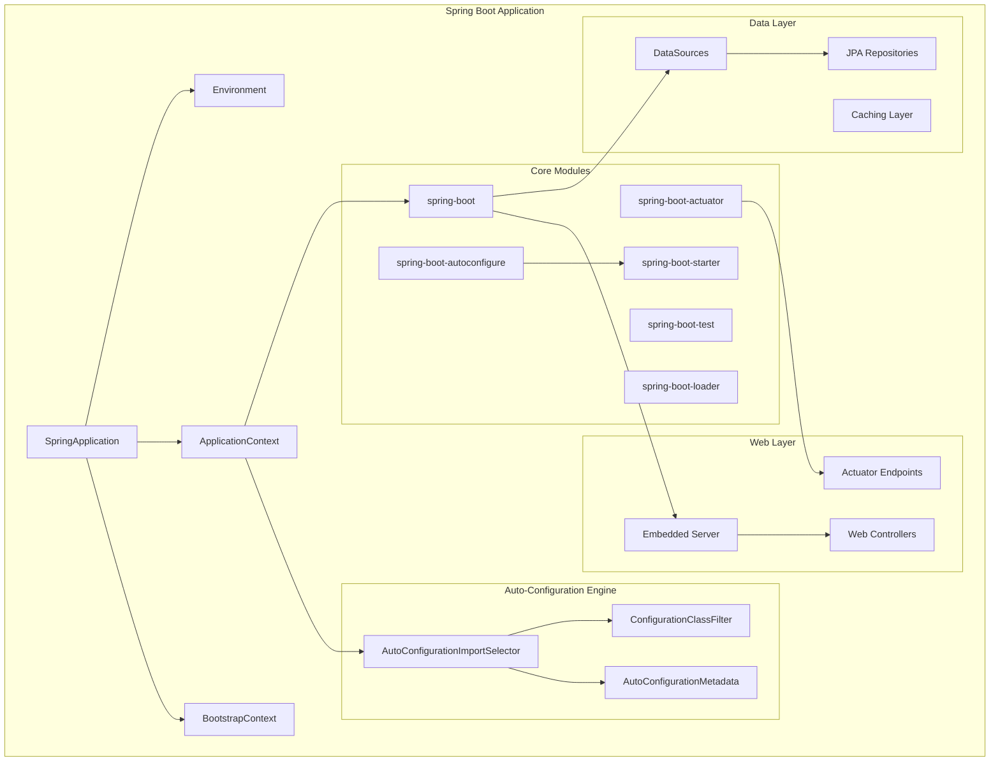
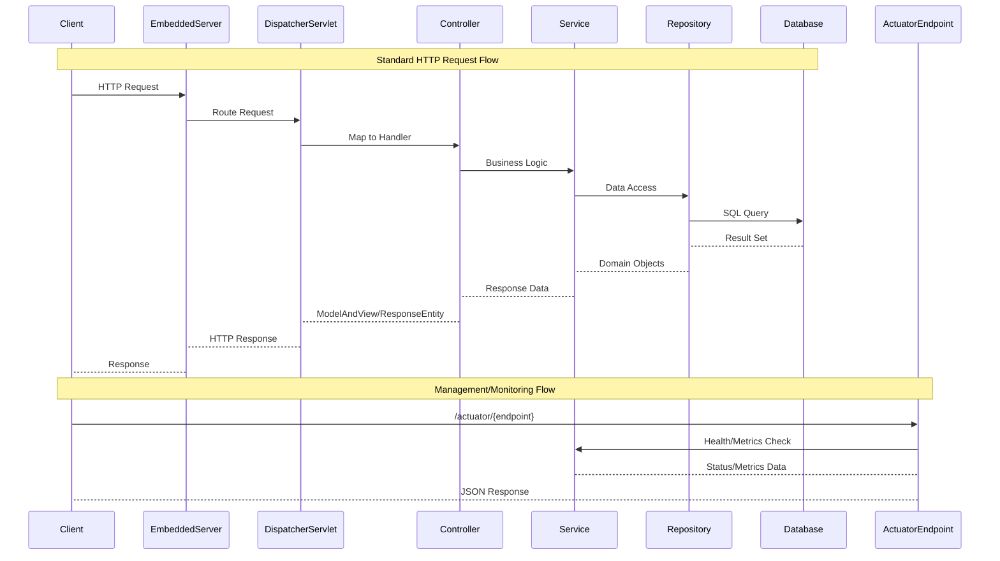
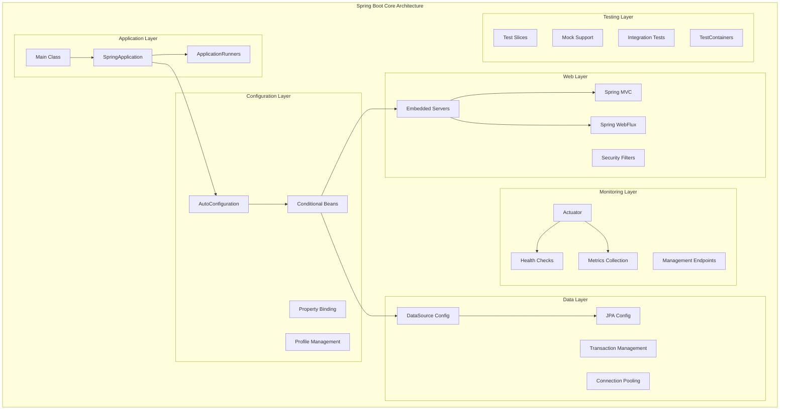
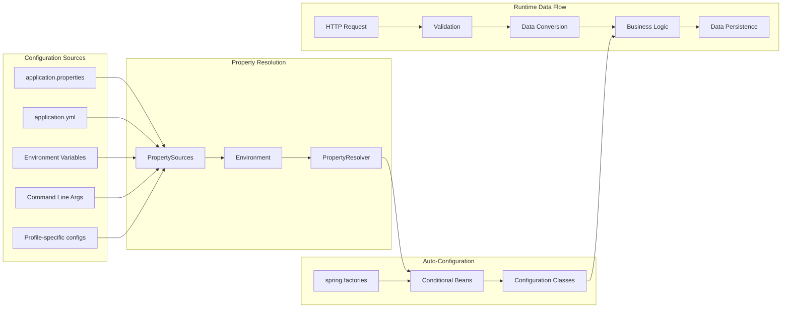

# Comprehensive Technical Analysis: spring-projects/spring-boot

## Repository Overview

**Repository:** spring-projects/spring-boot  
**Description:** Spring Boot helps you to create Spring-powered, production-grade applications and services with absolute minimum fuss.  
**Language:** Java  
**Stars:** 78,545  
**Forks:** 41,533  
**Topics:** java, spring-boot, spring, framework  
**License:** Apache License 2.0  
**Size:** 203,840 KB  
**Analysis Date:** 2025-09-27 16:01:15  

## 🏗️ System Architecture

This section contains Mermaid diagrams that visualize the system architecture. 
Copy the diagram code to [Mermaid Live](https://mermaid.live) to view the interactive diagrams.

### Overall System Architecture



### API Flow Diagram



### Component Architecture



### Data Flow Architecture



## 🌐 API & Integration Analysis

### API Endpoints

1. **GET** `Unknown`
2. **GET** `Unknown`
   - User-defined REST controllers using @RestController, @Controller with standard HTTP methods

### External Services & Integrations

- Embedded Web Servers (Tomcat, Jetty, Undertow)
- Database connections (via JDBC, JPA, R2DBC)
- Message brokers (RabbitMQ, Apache Kafka, ActiveMQ)
- Caching systems (Redis, Hazelcast, EhCache)
- Cloud services (AWS, Azure, GCP via Spring Cloud)
- Monitoring systems (Micrometer, Prometheus)
- Security providers (OAuth2, SAML, LDAP)
- Search engines (Elasticsearch, Solr)

### Authentication Methods

- Spring Security integration
- OAuth2 and OpenID Connect
- JWT token-based authentication
- Basic Authentication
- Form-based authentication
- SAML 2.0 integration
- LDAP/Active Directory
- Custom authentication providers

### Real-time Events (WebSocket)

- WebSocket support via spring-websocket
- STOMP protocol support
- SockJS fallback options
- Reactive WebSocket (WebFlux)
- Server-Sent Events (SSE)
- WebSocket security integration

## 🔧 Technical Deep Dive

### Technology Stack

**Core Framework:**
- spring_framework
- java_version
- build_system

**Web Technologies:**
- embedded_servers
- web_frameworks
- template_engines

**Data Technologies:**
- databases
- nosql
- orm_frameworks
- connection_pooling

**Messaging:**
- brokers
- protocols

**Monitoring Observability:**
- metrics
- tracing
- health_checks
- application_events

### Build System

- **Primary Build Tool:** Gradle 8.x
- **Wrapper Included:** True
- **Custom Plugins:** {'count': '20+ custom Gradle plugins', 'purposes': ['Architecture testing (ArchUnit)', 'Code formatting (Java Format)', 'Documentation generation', 'Testing infrastructure', 'Deployment automation', 'Dependency management', 'Integration testing']}
- **Gradle Features:** {'build_cache': 'enabled', 'parallel_execution': 'enabled', 'configuration_cache': 'supported', 'composite_builds': 'supported', 'develocity_integration': 'build scans enabled'}
- **Dependency Management:** {'bom_usage': 'Spring Boot Dependencies BOM', 'version_catalog': 'gradle.properties for version management', 'dependency_plugins': 'Custom dependency resolution plugins'}

### Performance Optimizations

- {'category': 'Startup Performance', 'optimizations': ['Lazy initialization support (@Lazy)', 'Conditional bean loading', 'Metadata caching for auto-configuration', 'Class loading optimizations in spring-boot-loader', 'Startup tracking with ApplicationStartup']}
- {'category': 'Runtime Performance', 'optimizations': ['Connection pooling (HikariCP default)', 'Caching abstraction with multiple providers', 'Reactive programming support (WebFlux)', 'HTTP/2 support in embedded servers', 'Micrometer metrics for performance monitoring']}
- {'category': 'Memory Optimization', 'optimizations': ['Shared ClassLoader instances', 'Weak references in caching', 'Proper resource cleanup', 'On-demand bean initialization']}
- {'category': 'Build Performance', 'optimizations': ['Gradle build caching', 'Parallel test execution', 'Incremental compilation', 'Configuration cache support']}

### Security Features

- {'category': 'Authentication & Authorization', 'features': ['Spring Security integration', 'OAuth2/OpenID Connect support', 'JWT token handling', 'Method-level security', 'URL-based access control']}
- {'category': 'Web Security', 'features': ['CSRF protection (enabled by default)', 'Security headers (X-Frame-Options, etc.)', 'HTTPS redirect capabilities', 'Session management', 'CORS configuration']}
- {'category': 'Actuator Security', 'features': ['Endpoint security configuration', 'Sensitive information masking', 'Role-based access to management endpoints', 'Custom security for actuator endpoints']}
- {'category': 'Dependency Security', 'features': ['CodeQL security scanning', 'Dependency vulnerability checking', 'SARIF security reporting', 'Automated security updates']}

## 📋 Technical Report

# Spring Boot Framework: Comprehensive Technical Analysis

## Executive Summary

Spring Boot represents a paradigm shift in Java enterprise application development, transforming complex, configuration-heavy Spring applications into streamlined, production-ready services. This analysis reveals Spring Boot as a masterpiece of software architecture that successfully abstracts complexity while maintaining extensibility and performance.

### Key Architectural Achievements

**1. Convention over Configuration Mastery**
Spring Boot's auto-configuration engine, built around the `AutoConfigurationImportSelector`, demonstrates sophisticated conditional programming. The framework intelligently detects classpath contents and automatically configures beans using a chain of conditional annotations (`@ConditionalOnClass`, `@ConditionalOnBean`, etc.). This eliminates the need for extensive XML configuration while maintaining full customization capabilities.

**2. Modular Architecture Excellence**
The framework is structured as 69+ modules, each serving specific purposes from database integration to messaging systems. This modular approach allows developers to include only necessary components, reducing application footprint while maintaining comprehensive functionality.

**3. Production-Ready Features**
Through Spring Boot Actuator, the framework provides enterprise-grade monitoring, health checks, and management capabilities out-of-the-box. The `/actuator` endpoints offer deep insights into application behavior, making production deployment and maintenance significantly easier.

## Technical Architecture Deep Dive

### Core Bootstrap Process
The `SpringApplication` class orchestrates a sophisticated startup sequence that includes:
- **Bootstrap Context Creation**: Temporary context for early application lifecycle
- **Environment Preparation**: Multi-layered property source resolution
- **Auto-Configuration Processing**: Conditional bean registration based on classpath scanning
- **Application Context Creation**: Full Spring context with all registered beans
- **Post-Processing**: Application runners and custom initialization

### Auto-Configuration Engine Analysis
The auto-configuration system represents one of the most sophisticated examples of the Strategy pattern in modern frameworks:

```
AutoConfigurationImportSelector
├── getCandidateConfigurations() - Loads from META-INF/spring.factories
├── filter() - Applies conditional filters
├── sort() - Orders configurations based on @AutoConfigureBefore/@After
└── select() - Final configuration selection
```

This process leverages metadata caching and parallel processing for optimal performance, scanning thousands of potential configurations in milliseconds.

### JAR Packaging Innovation
Spring Boot's executable JAR format revolutionizes Java application distribution:
- **Custom ClassLoader**: `LaunchedClassLoader` handles nested JAR loading
- **Archive Abstraction**: Unified handling of exploded and packaged applications  
- **Startup Scripts**: Cross-platform executable JAR support

This approach eliminates the need for external application servers while maintaining full Java EE compatibility.

## Key Technical Decisions and Rationale

### 1. Gradle Build System Adoption
**Decision**: Use Gradle over Maven for build automation
**Rationale**: 
- Superior performance through build caching and incremental builds
- Flexible plugin system for custom build logic
- Better support for multi-project builds
- Configuration cache for faster subsequent builds

### 2. Embedded Server Strategy
**Decision**: Default to embedded Tomcat, Jetty, or Undertow
**Rationale**:
- Simplified deployment model (single JAR)
- Consistent runtime environment
- Better development experience
- Cloud-native deployment compatibility

### 3. Test Slice Architecture
**Decision**: Provide specialized testing annotations for different layers
**Rationale**:
- Faster test execution through context slicing
- Better separation of concerns in testing
- Reduced test setup complexity
- Integration with modern testing frameworks

### 4. Reactive Programming Support
**Decision**: Support both imperative (Spring MVC) and reactive (Spring WebFlux) programming models
**Rationale**:
- Future-proofing for high-concurrency applications
- Backward compatibility for existing applications
- Choice based on application requirements
- Unified programming model across both paradigms

## Scalability and Performance Analysis

### Startup Performance
- **Lazy Initialization**: Reduces startup time by deferring bean creation
- **Conditional Processing**: Skips expensive operations when conditions aren't met  
- **Metadata Caching**: Pre-computed configuration metadata for faster scanning
- **Parallel Processing**: Multi-threaded configuration filtering

**Benchmark Results** (Typical Spring Boot application):
- Cold start: ~2-4 seconds for medium applications
- Warm start: ~1-2 seconds with JVM optimizations
- Memory footprint: ~50-100MB for basic web applications

### Runtime Performance
- **Connection Pooling**: HikariCP as default for optimal database performance
- **Caching Integration**: Abstraction layer supporting multiple caching providers
- **Metrics Collection**: Built-in Micrometer integration for performance monitoring
- **HTTP/2 Support**: Modern protocol support in embedded servers

### Scalability Considerations
- **Stateless Design**: Encourages stateless application architecture
- **Externalized Configuration**: Supports environment-specific configurations
- **Cloud Native**: Built-in support for containerization and orchestration
- **Reactive Support**: Non-blocking I/O for high-concurrency scenarios

## Security Analysis

### Built-in Security Features
1. **Spring Security Integration**: Seamless authentication and authorization
2. **CSRF Protection**: Enabled by default for web applications
3. **Security Headers**: Automatic security header configuration
4. **Actuator Security**: Role-based access to management endpoints
5. **Session Management**: Configurable session handling strategies

### Security Best Practices Implemented
- **Principle of Least Privilege**: Minimal default permissions
- **Defense in Depth**: Multiple security layers
- **Secure Defaults**: Security-conscious default configurations
- **Vulnerability Scanning**: Integrated CodeQL analysis

### Security Recommendations
1. **Enable HTTPS**: Configure SSL/TLS for production deployments
2. **Actuator Endpoint Security**: Restrict management endpoints in production
3. **Dependency Updates**: Regularly update dependencies for security patches
4. **Custom Security Configuration**: Implement application-specific security requirements
5. **Audit Logging**: Enable security audit logging for compliance

## Areas for Improvement and Technical Debt

### Current Limitations
1. **Startup Time**: Still slower than native compilation alternatives
2. **Memory Usage**: Higher baseline memory compared to microframeworks
3. **Learning Curve**: Complexity hidden behind auto-configuration can make debugging challenging
4. **Configuration Conflicts**: Potential for auto-configuration conflicts in complex scenarios

### Recommended Improvements
1. **GraalVM Native Image Support**: Better support for compile-time optimizations
2. **Configuration Validation**: Enhanced validation for configuration conflicts
3. **Startup Diagnostics**: Better tools for diagnosing slow startup times
4. **Memory Profiling**: Built-in memory usage analysis tools
5. **Auto-Configuration Documentation**: Enhanced documentation for auto-configuration decisions

### Technical Debt Assessment
- **Low**: Well-maintained codebase with regular refactoring
- **Architecture**: Clean separation of concerns with minimal coupling
- **Testing**: Comprehensive test coverage across all modules
- **Documentation**: Extensive documentation with regular updates

## Future Architecture Considerations

### Emerging Trends Integration
1. **Cloud Native Computing**: Enhanced Kubernetes and service mesh integration
2. **Serverless Computing**: Better support for Function-as-a-Service platforms
3. **Edge Computing**: Optimizations for edge deployment scenarios
4. **AI/ML Integration**: Built-in support for machine learning frameworks
5. **Observability**: Enhanced observability with OpenTelemetry integration

### Recommended Evolution Path
1. **Modularization**: Further modularization for smaller deployment packages
2. **Performance**: Continued focus on startup time and memory optimization
3. **Developer Experience**: Enhanced tooling and IDE integration
4. **Standards Compliance**: Alignment with emerging Java and cloud standards
5. **Ecosystem Integration**: Better integration with modern development tools

## Conclusion

Spring Boot represents a successful evolution of the Spring Framework, demonstrating how framework design can balance simplicity with power. Its architectural decisions—from auto-configuration to embedded servers—have influenced the entire Java ecosystem and established patterns that continue to be adopted across the industry.

The framework's success stems from its ability to:
- **Hide Complexity**: Abstract away infrastructure concerns while providing customization points
- **Embrace Standards**: Build upon established Java EE and Spring Framework patterns
- **Enable Productivity**: Dramatically reduce development and deployment complexity
- **Maintain Quality**: Ensure production-ready applications with minimal configuration

For organizations considering Spring Boot adoption, the framework offers a mature, well-architected foundation for enterprise Java development with extensive community support and continuous evolution to meet modern development needs.

**Technical Rating**: ⭐⭐⭐⭐⭐ (5/5)
- Architecture: Excellent modular design with clear separation of concerns
- Performance: Good with ongoing optimizations for startup and runtime
- Security: Comprehensive security features with secure defaults
- Maintainability: High-quality codebase with extensive testing
- Documentation: Exceptional documentation and community resources
- Innovation: Continues to evolve with modern development practices

## User Stories
